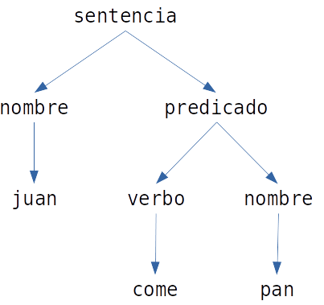

# Estructuras de datos en prolog
## Estructuras y árboles

De manera general para poder crear una estructura de un árbol en prolog, se debe de hacer uso de:
    
```prolog
    Y = f(X, g(X, a)).
    Y = f(X, g(X, a)), X = b.
```
Como se puede observar a continuación, los árboles se crean de manera visual de la siguiente manera, como se puede
observar en la imagen a continuación:



## Listas
Son estructuras con functor `[|]` y aridad 2, cuyos argumentos son:
* **Cabeza**: un término de cualquier tipo.
* **Cola**: lista vacía `[]` o bien otra estructura de tipo lista.
* **Lista vacía**: `[]` es un átomo.

Se trata de una estructura de datos **lista simplemente enlazada**. Se representan con, sus elementos separados por
comas y encerrados entre corchetes. De manera general se tienen los siguientes ejemplos:

```prolog
    [a] = '[|]'(a, '[]').
    [a, b, c] = '[|]'(a, '[|]'(b, '[|]'(c, '[]'))).
```
`[X|Y]` representa la lista con **cabeza** X y **cola** Y.

# Acumuladores y estructuras en diferencia

## Acumuladores
Los acumuladores son una forma de recorrer una lista, en la cual se va acumulando un valor, el cual se va modificando.
De manera general se tiene el siguiente ejemplo:

```prolog
    suma([], 0).
    suma([X|Y], S) :- suma(Y, S1), S is S1 + X.
```

O bien, de manera más general:

```prolog
    acumula([], A, A).
    acumula([X|Y], A, R) :- A1 is A + X, acumula(Y, A1, R).
```

Otro ejemplo a tener en cuenta puede ser:
```prolog
    % listlen.prolog
    listlen([],0).
    listlen([_|T],N) :- listlen(T,N1), N is N1 + 1.
    
    % Un ejemplo de uso es:
    ?- trace, listlen([1,2,3], N).
```

Las **ventajas** de los acumuladores se encuentran principalmente en que son más rápidas al no repasar dos veces la
lista (no hace uso de append/3).

En cambio, las **desvetajas** que se pueden encontrar, se basan principalmente en la realización del orden inverso, ya
que, sigue repitiendo piezas.

## Estructuras en diferencia

Las estructuras en diferencia son una forma de representar una lista, en la cual se tiene una lista de elementos que se
desean eliminar de otra lista. De manera general se tiene el siguiente ejemplo:

```prolog
    % partsof3.prolog
    partsof(X,P) :- partsacc(X,P,Hole), Hole = [].

    partsacc(X,[X|Hole],Hole) :- basicpart(X).
    partsacc(X,P,Hole) :-
                    assembly(X,Subparts),
                    partsacclist(Subparts,P,Hole).

    partsacclist([],Hole,Hole).
    partsacclist([P|Tail],Total,Hole) :-
                    partsacc(P,Total,Hole1),
                    partsacclist(Tail,Hole1,Hole).
    % Nótese que para el caso anterior, las sentencias
    % basicpart, hacen referencia a una base de datos que
    % ha sido creada previamente.
```

Las **ventajas** de las estructuras en diferencia se encuentran principalmente en que son más rápidas al no repasar dos
veces la lista (no hace uso de append/3), además, el orden de la lista debe de tener un orden concreto.

La principal **desventaja** que se puede encontrar, se basa en que sigue repitiendo piezas.

# El corte "!"

Haciendo uso del predicado !/0 se indica a prolog que elecciones previas no necesitan reconsiderarse nuevamente en caso
de vuelta atrás. Las **ventajas** que se pueden encontrar frente a esto, se basan en:
* **Rapidez**: no se pierde tiempo tratando de buscar metas que sabemos no contribuyen a la solución.
* **Espacio**: se ocupa menos memoria, ya que no es necesario almacenar los punto de retorno de la vuelta atrás.

El predicado !/0:

Produce un éxito inmediatamente. Cualquier intento de resatisfacer cualquier subobjetivo entre la meta y el corte fallará.

Un ejemplo para poder entender todo esto anterior es:

```prolog
    % biblio.prolog
    facilidades(Pers,Fac) :-
	libro_caducado(Pers,_),
	!,
	fac_basicas(Fac).

    facilidades(_,Fac) :- fac_generales(Fac).

    fac_basicas(consultar_ref).
    fac_basicas(preguntas).

    fac_adicionales(prestamos).
    fac_adicionales(pedidos_otras_bibl).

    fac_generales(X) :- fac_basicas(X).
    fac_generales(X) :- fac_adicionales(X).

    libro_caducado('P. Garcia',libro1854).
    libro_caducado('J. Ramirez',libro10250).
    libro_caducado('H. Hernandez', libro762).

    cliente('P. Garcia').
    cliente('J. Ramirez').
    cliente('H. Hernandez').
    cliente('L. Guillama').
    cliente('J. Gonzalez').
```

### Usos más comunes del cut:
1. Confirmar que se ha encontrado la regla correcta para un subobjetivo dado.
2. Indicar lugar en que falle (! seguido de fail/0) un subobjetivo inmediatamente, sin necesidad de ver soluciones alternativas.
3. Indicar lugar donde terminen de generarse soluciones alternativas a través de vuelta atrás.

Otro ejemplo de esto anterior, para poder entender:

```prolog
    ingr_inversiones(juan,1).
    ingr_inversiones(pedro,0).
    ingr_inversiones(pepe,17).
    ingr_inversiones(manuel,1).
    ingr_inversiones(juana,1).

    salario_bruto(juan,4).
    salario_bruto(pedro,1).
    salario_bruto(pepe,10).
    salario_bruto(manuel,5).
    salario_bruto(juana,5).

    pension_recivida(juan,6).
    pension_recivida(rosa,3).

    extranjero(manuel).

    conyuge(juana,pepe).

    % declara.prolog
    /* Ejemplo con cut para distingir a contribuyentes  */
    /* con posibilidad de declaracion simplificada      */
    decl_simp(X) :- write('dcl1 '),
    	extranjero(X), !, fail.
    decl_simp(X) :- write('dcl2 '),
            conyuge(X,Y),
            ingr_brutos(Y, Ing),
            Ing > 3,
            !, fail.
    decl_simp(X) :- write('dcl3 '),
            ingr_brutos(X, Ing),
            2 < Ing, 20 > Ing.

    ingr_brutos(X,_) :- write('ingr_brutos1 '),
    	pension_recivida(X,P),
        P < 5,
        !, fail.
    ingr_brutos(X,Y) :- write('ingr_brutos2 '), 
            salario_bruto(X,Z),
            ingr_inversiones(X,W),
            Y is Z + W.
        
    % Definición de not/1 (predicado interno)
    not(P) :- call(P), !, fail.
    not(_).

    % Otra definición de not/1 usando '->/2'
    not(P) :- (call(P) -> fail ; true).
```

